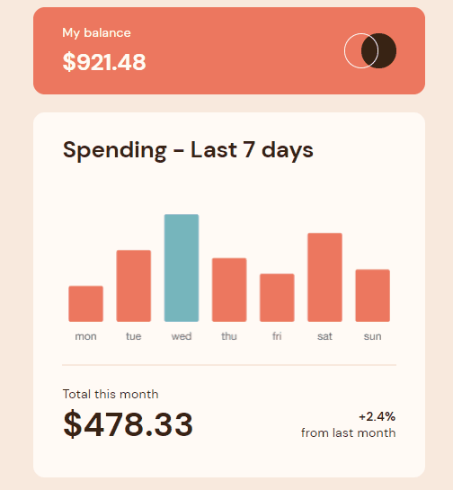

<h1 align="center">Expenses Chart Component</h1> 
Responsive bar chart component with interactive hover states, highlighting the current day, and dynamically generated bars based on local JSON data

<div align="center">
  
</div>

<div align="center">
  <h2><a href="https://veraenders.github.io/expenses-chart-component/">Live</a>
  <span> | </span> 
  <a href="https://github.com/VeraEnders/expenses-chart-component">Code</a></h2>
  <div>This is a solution to the <a href="https://www.frontendmentor.io/challenges/expenses-chart-component-e7yJBUdjwt">Expenses chart component challenge</a> on FrontendMentor.</div>
</div>
<br>

## About the project 

This  challenge is to build out this bar chart component and get it looking as close to the design as possible.

Users should be able to:

- View the bar chart and hover over the individual bars to see the correct amounts for each day
- See the current day’s bar highlighted in a different colour to the other bars
- View the optimal layout for the content depending on their device’s screen size
- See hover states for all interactive elements on the page

## Built with

- Semantic HTML5 markup
- SASS / SCSS
- Mobile-first workflow
- [Chart.js](https://www.chartjs.org/) is a powerful JS library for creating interactive charts and graphs

## Features

### Dynamic Bar Generation
1. The Expenses Chart Component fetches data from a local JSON file using the fetch API. 

The component maps the fetched data to extract the labels and amounts, which are then used to create the chart.

```
fetch('./src/data/data.json')
  .then(response => response.json())
  .then(data => {
    const labels = data.map(item => item.day);
    const amounts = data.map(item => item.amount);
    createChart(labels, amounts);
  })
  .catch(error => {
    console.error('Error:', error);
  });
```
2. ChartJS is utilized to render the dynamic bar chart.

Each bar represents a day, with the height of the bar indicating the expense amount for that day.

The component takes advantage of ChartJS's versatile options and features to configure the chart's appearance, including the bar colors, hover states, and tooltips.
```
new Chart(chartID, {
    type: 'bar',
    data: {
      ...
    },
    options: {
      ...
    },
  });
```

## Author

GitHub - [VeraEnders](https://github.com/VeraEnders)

FrontendMentor - [@veraenders](https://www.frontendmentor.io/profile/veraenders)